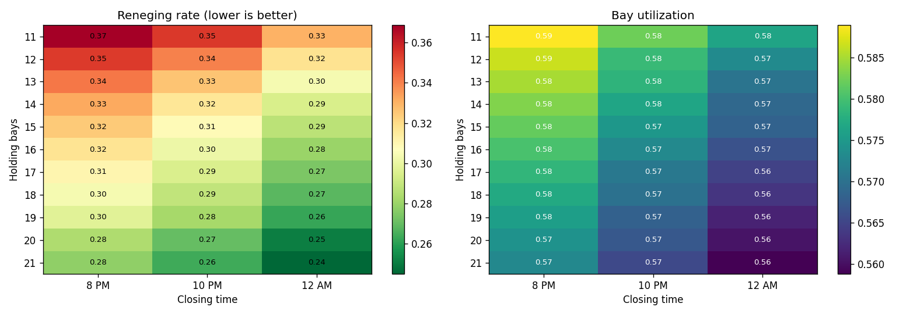
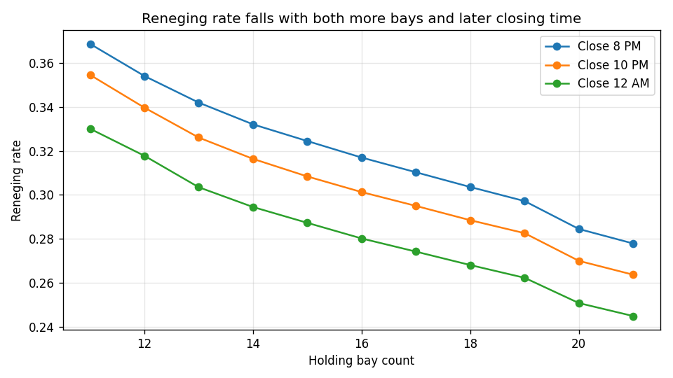
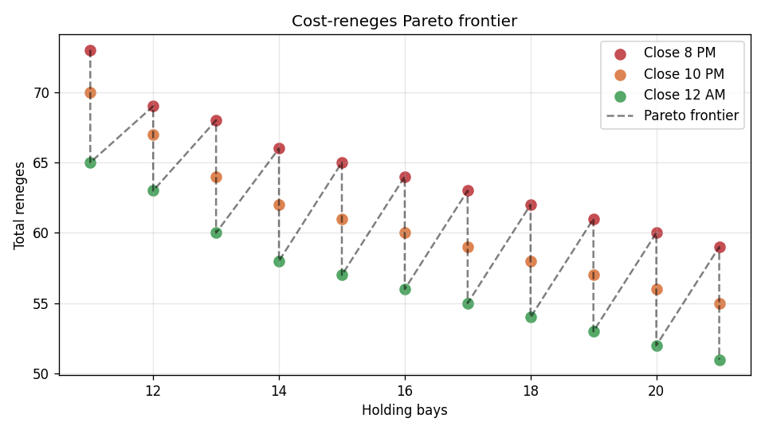

# Hospital ED Capacity Planning — Arena Simulation + Scenario Analysis

**[Live demo](https://hospital-ed-simulation.streamlit.app)** — runs in your browser, no install required.

Discrete-event simulation (DES) of a **joint cardiac catheterization and
electrophysiology lab** to drive a bay-count and operating-hours recommendation.
Built in Arena; a Python analysis layer reads the 33 scenario outputs and
ranks them on the cost/reneges Pareto frontier.



## What the model covers

- Patient arrivals (Poisson, time-varying)
- Pre-procedure preparation in admission bays
- 12 parallel lab stations (cath + EP)
- Post-procedure recovery in a configurable pool of holding bays
- After-hours logic: late-arriving patients get transferred when the lab closes

## Experiment design (33 scenarios)

| Factor | Levels |
|---|---|
| Holding bay count | 11, 12, 13, …, 21 |
| Closing time | 8 PM, 10 PM, 12 AM |

10 replications per scenario. Key outputs: reneging rate, CATH / EP wait time,
hold-for-bay queue time, bay and lab utilization, absolute reneges, bay seizures.

## Key findings

- **Closing time dominates bay count** as a lever — extending from 8 PM to 12 AM cuts reneging by ~20 % at every bay count.
- **Bay utilization collapses past ~16 bays** — diminishing returns on capacity.
- The Pareto frontier exposes ~8 efficient scenarios; under plausible cost parameters the recommendation lands in the **16 – 18 bay, 10 PM closing** region.




## Repository layout

```
.
├── scenario_analysis.ipynb     ← Python analysis of the 33 scenario outputs
├── scenario_analysis_app.py    ← Streamlit dashboard (cost grid, Pareto, scenario filter)
├── hospital_lab_model.doe      ← Arena DES model
├── problem_brief.pdf           ← problem definition, inputs, conceptual model
├── scenario_results.xlsx       ← consolidated 33-scenario results
├── input_data.xlsx             ← arrival-pattern / service-time inputs
├── reneging_vs_bays.png, utilization_vs_bays.png,
│   scenario_heatmaps.png, pareto_frontier.png   ← figures generated by the notebook
├── requirements.txt
└── README.md
```

## Run it

The Arena model requires **Rockwell Arena Simulation** (Windows) to modify
or re-run. The Python tooling only needs the consolidated scenario-results
workbook.

### Notebook walkthrough

```bash
pip install -r requirements.txt
jupyter notebook scenario_analysis.ipynb
```

### Interactive dashboard

```bash
streamlit run scenario_analysis_app.py
```

The dashboard:

- **Cost-assumption sliders** — set the dollar value of each renege, the
  amortised monthly cost per bay, and the overtime cost of each closing
  time. The recommended configuration updates immediately under the new
  assumptions.
- **Cost grid heatmap** — every (bay count × closing time) cell coloured
  by total cost; the recommended cell is outlined.
- **Pareto frontier** — scatter of all 33 scenarios with the cost-reneges
  Pareto frontier highlighted; the recommendation is starred.
- **Scenario filters** — narrow to a bay-count range or a subset of
  closing times.
- **Single-metric view** — chart any output (reneges, wait times, bay or
  lab utilization) as a function of bay count for each closing time.

## Stack

Rockwell Arena (DES model) · Python / pandas (cross-scenario analysis) ·
matplotlib (viz) · Excel (scenario wrapping)
